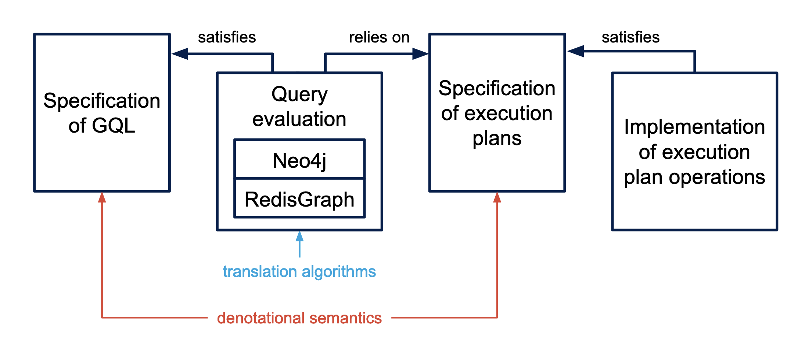

# GQL in Coq

In this project we mechanize a subset of [GQL](https://en.wikipedia.org/wiki/Graph_Query_Language/)/[Cypher](https://neo4j.com/developer/cypher/) languages in [Coq](https://coq.inria.fr/). The goal is to provide a formal specification of the language and to prove correctness of the key implementation details of two reference databases: [Neo4j](https://neo4j.com/) and [RedisGraph](https://redis.io/docs/stack/graph/).

The project is described in the thesis ["Mechanizing Graph Query Languages in Coq"](papers/panenkov-thesis.pdf).

## Short description
### Specified subset

We only specify the read-queries of the following form:
```sql
MATCH p
RETURN *
```
where `p` is a path pattern where vertex and edge patterns can have names, labels and properties all of which are optional. For example:
```
(p:Person)-[e:KNOWS]->(:Person {name: "Alice"})
```

### Query evalation

In general, graph databases evaluate queries in the following steps:
1. The query is parsed.
2. The query is normalized.
3. The normalized query is translated to an execution plan.
4. The execution plan is evaluated.

Our project is focused on the last two steps. We specify the normalized query and the execution plan and prove that the execution plan evaluates to the correct result.

## Architecture

The project consists of the following components:


## Dependencies

We use the following libraries:
- [hahn](https://github.com/vafeiadis/hahn) for a lot of convenient automation tactics;
- [relational-algebra](http://perso.ens-lyon.fr/damien.pous/ra/) for the boolean matrices.

## Project structure

We have the following files in the project. Each file depends only on the
files that are listed before:

- `Utils.v` contains some utility definitions and lemmas that are absent
in the standard library;
- `RAUtils.v` contains some utility definitions and lemmas that are ab-
sent in the relational-algebra library;
- `Maps.v` contains the definitions of total and partial maps, which are
then used to define records and their types, the update syntax and
some lemmas about them;
- `PropertyGraph.v` contains the definition of the property graphs;
- `Cypher.v` contains the definition of the GQL abstract syntax, includ-
ing names and path patterns;
- `BindingTable.v` contains the definitions of the values, types and
binding tables;
- `Semantics.v` contains the specification of the GQL semantics, includ-
ing matching modes and the pattern-matching predicate;
54
- `PatternE.v` contains the definitions of the pattern and path slices and
the pattern-matching predicate for them;
- `ExecutionPlan.v` contains the specification of the execution plan;
- `Translation.v` contains the Neo4j-like translation algorithm and the
proof of its correctness;
- `Translation2.v` contains the RedisGraph-like translation algorithm
and the proof of its correctness;
- `TraverseOpImpl.v` contains the implementation of the Traverse op-
eration and the proof of its correctness;
- `ExecutionPlanImpl.v` contains the implementation of all the other
operations and the proof of their correctness.

## Building 
You must have `opam` [installed](https://opam.ocaml.org/doc/Install.html).

For an easy start run in the project root:
```console
$ ./make_switch.sh
```
This will create a local `opam` switch, configure repositories, and install all the dependencies.

To generate all the necessary configuration files and build all the theories you can simply run `make` (or more specifically `make build`).

Note that this will create all the build artefacts right in the `src` next to the theories sources. To clean up the auxilliary files and the build artefacts run `make clean`.

## IDE support

Note that some IDEs require to be configured to work with the local `coq` installation. For example, to be able to use it with [VSCoq](https://marketplace.visualstudio.com/items?itemName=maximedenes.vscoq) plugin you have to set `Coq: Bin Path` setting. You can look up the path with `where coqtop` command when the local switch is active (note that you need to provide path to the `bin` folder where the executable is contained, not to the executable itself).

### CTags support

This project supports basic jump-to-definition IDE features with Ctags. Note that you need to configure your Universal Ctags installation as described in [coq.ctags](https://github.com/tomtomjhj/coq.ctags) README.

To generate `.tags` file run:
```console
$ make tags
```

For example, you can use this file in VSCode with [CTags Support](https://marketplace.visualstudio.com/items?itemName=jaydenlin.ctags-support) plugin.

## Known issues / things to improve
- The project is not tested with last versions of Coq.
- We treat binding tables as sets of records, i.e. we do not account for the order and multiplicity of records. Therefore, we can't formalize clauses like `ORDER BY` and `DISTINCT`.
- We do not accurately mechanize expressions. In particular, the behavior of `UNKNOWN` values might not be correct. Therefore, we can't claim that the potential specification of `WHERE` and `RETURN` clauses is correct.
- The specification of execution plan operations is verbose. In particular, we have two functional axioms for each operation that describe what the resulting table should contain. We can rewrite two axioms as a single one in the form using `<->` and `exists`. This approach has proven to be successful in `TraverseOpImpl.v`.

## Relation to the thesis

The following table shows the correspondence between the definitions and theorems in the thesis and the mechanization:
| thesis item       | coq file              | coq item(s)               |
|-------------------|-----------------------|---------------------------|
| def. 1            | `BindingTable.v`  | `Value.t` and `Value.T`   |
| def. 2            | `BindingTable.v`  | `Value.type_of`           |
| def. 3            | –                 | –                         |
| def. 4 and 5      | `PropertyGraph.v` | `PropertyGraph`           |
| def. 6            | `BindingTable.v`  | `Rcd.t`                   |
| def. 7            | `Maps.v`          | `PartialMap.update`       |
| def. 8            | `BindingTable.v`  | `Rcd.T` and `Rcd.type_of` |
| def. 9            | –                 | –                         |
| def. 10           | `BindingTable.v`  | `BindingTable.t`          |
| def. 11           | `BindingTable.v`  | `BindingTable.of_type`    |
| def. 12           | `Cypher.v`        | `Pattern.pvertex` and `Pattern.pedge`    |
| def. 13           | `Cypher.v`        | `Pattern.t`               |
| def. 14           | `Semantics.v`     | `Path.t`                  |
| def. 15           | `Semantics.v`     | `Name.t`                  |
| def. 16           | `Semantics.v`     | `Path.matches`            |
| def. 17           | `Semantics.v`     | `MatchMode.t`             |
| def. 18           | –                 | –                         |
| def. 19           | `Semantics.v`     | `MatchMode.update_notations` |
| def. 20           | `Semantics.v`     | `Path.matches`            |
| def. 21           | `Semantics.v`     | `PatternT.type_of`        |
| thm. 1            | `Semantics.v`     | `Path.matches_type_of`    |
| def. 22           | `BindingTable.v`  | `Rcd.explicit_proj`       |
| thm. 2            | `Semantics.v`     | `Path.matches_explicit_proj` |
| thm. 3            | `Semantics.v`     | `Path.matches_explicit_exists_proj` |
| def. 23           | `BindingTable.v`  | `Rcd.explicit_projT`      |
| thm. 4.1          | `BindingTable.v`  | `Rcd.type_of_explicit_proj` |
| thm. 4.2          | `Semantics.v`     | `PatternT.explicit_projT_type_of` |
| thm. 4.3          | –                 | –                         |
| def. 24           | `Cypher.v`        | `Pattern.wf`              |
| def. 25           | `Cypher.v`        | `Query.wf`                |
| def. 26           | `Semantics.v`     | `EvalQuery.Spec.eval_match_clause` |
| def. 27           | `Semantics.v`     | `EvalQuery.Spec`          |
| thm. 5            | `Semantics.v`     | `EvalQuery.SpecComplete`  |
| thm. 6            | –                 | –                         |
| def. 28           | `ExecutionPlan.v` | `ExecutionPlan.Spec`      |
| def. 29           | `ExecutionPlan.v` | `ExecutionPlan.Spec`      |
| def. 30           | `ExecutionPlan.v` | `ExecutionPlan.t`         |
| def. 31           | `ExecutionPlan.v` | `ExecutionPlan.EvalPlan.eval` |
| def. 32           | `ExecutionPlan.v` | `ExecutionPlan.type_of`   |
| def. 33           | `ExecutionPlan.v` | `ExecutionPlan.wf`        |
| thm. 7            | `ExecutionPlan.v` | `ExecutionPlan.EvalPlan.eval_wf` |
| thm. 8            | `ExecutionPlan.v` | `ExecutionPlan.EvalPlan.eval_type_of` |
| def. 34           | `Translation.v`   | `translate_pattern'`      |
| def. 35           | `Translation.v`   | `translate_pattern`       |
| lem. 1            | `Translation.v`   | `translate_pattern'_type` |
| thm. 9            | `Translation.v`   | `translate_pattern_type`  |
| lem. 2            | `Translation.v`   | `EvalQueryImpl.eval_translate_pattern'_spec` and `EvalQueryImpl.eval_translate_pattern'_spec'` |
| thm. 10           | `Translation.v`   | `EvalQueryImpl.match_clause_spec` and `EvalQueryImpl.match_clause_spec'` |
| lem. 3            | `Translation.v`   | `translate_pattern'_wf`   |
| thm. 11           | `Translation.v`   | `translate_pattern_wf`    |
| def. 36           | `PatternE.v`      | `PatternSlice.t`          |
| def. 37           | `PatternE.v`      | `PatternSlice.append`     |
| def. 38           | –                 | –                         |
| def. 39           | `PatternE.v`      | `PatternSlice.split'`     |
| thm. 12           | `PatternE.v`      | `PatternSlice.split'_*`   |
| def. 40           | `PatternE.v`      | `PatternSlice.split`      |
| thm. 13           | `PatternE.v`      | `PatternSlice.split_*`    |
| def. 41           | `PatternE.v`      | `PathSlice.t` and `PathSlice.append` |
| def. 42           | `PatternE.v`      | `PatternSlice.type_of`    |
| thm. 14           | `PatternE.v`      | `PatternSlice.split'_type_of` and `PatternSlice.split_type_of` |
| def. 43           | `PatternE.v`      | `PatternSlice.wf'`        |
| thm. 15.1         | `PatternE.v`      | `PatternSlice.split'_wf_slice` |
| thm. 15.2         | –                 | –                         |
| def. 44           | `PatternE.v`      | `PatternSlice.wf`         |
| thm. 16.1         | `PatternE.v`      | `PatternSlice.split_wf_slice` |
| thm. 16.2         | –                 | –                         |
| def. 45           | `PatternE.v`      | `PathSlice.last`          |
| def. 46           | `PatternE.v`      | `PathSlice.matches`       |
| thm. 17           | `PatternE.v`      | `PathSlice.matches_append` |
| thm. 18           | `PatternE.v`      | `PathSlice.matches_split` |
| thm. 19           | `PatternE.v`      | `PathSlice.matches_split_inv` |
| def. 47           | `Translation2.v`  | `translate_pattern'`      |
| thm. 20           | `Translation2.v`  | `EvalQueryImpl2.eval_translate_pattern'_spec` and `EvalQueryImpl2.eval_translate_pattern'_spec'` |
| def. 48           | `Translation2.v`  | `translate_pattern`       |
| thm. 21           | `Translation2.v`  | `EvalQueryImpl2.eval_match_clause_spec` and `EvalQueryImpl2.match_clause_spec'` |
